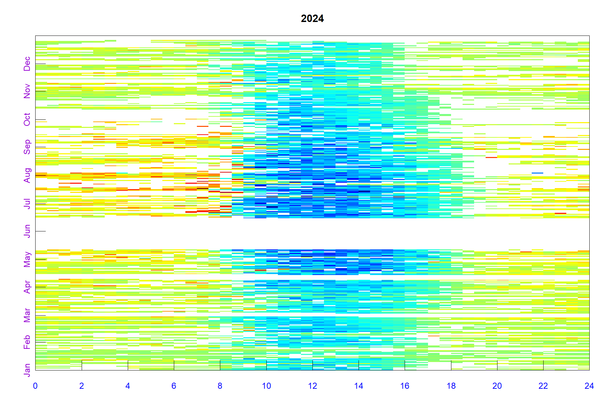

Reddyproc_seasonal
================
Benju
2024-01-22

USED FOR CRK 2022, 2023, 2024 Seasonal ustar filtering works better than
the reddyproc ustar

This is R scripts taken from Reddyproc and modified by me as required by
data Start with Reddyproc help

``` r
#help("REddyProc")
```

Packages

``` r
if (!requireNamespace("pacman", quietly = TRUE)) {
  install.packages("pacman")
}
pacman::p_load(ggplot2, readxl, dplyr, measurements, SciViews, googlesheets4, tidyverse, 
               lattice, plotrix, writexl, nlme, car, vegan, ggResidpanel, lme4, 
               moments, gridExtra,REddyProc,bigleaf,remotes,FluxGapsR)
```

PAR conversion to SWIN SWIN = PPFD (μmol m⁻² s⁻¹) × 0.219 Approximate
45% of SWIN is par 1 W m⁻² of PAR corresponds to approximately 4.57 μmol
m⁻² s⁻¹ of PPFD. Read data and change -9999 to nan Everytime change data
and change ustar

``` r
yyear <- 2024
sitename <- 'CRK' 
filePath <- sprintf("C:/Benju/Matlab_data_play/SouthernPine_DataAnalysis/Input Data/ReddyProc/Seasonal/%s/rp%s_%d.csv", sitename, sitename, yyear)

# Read the CSV file
EddyData <- read_csv(filePath, show_col_types = FALSE)
EddyData [EddyData == -9999] <- NA
EddyData [EddyData == "NaN"] <- NA
#Convert special table to data.frame 
EddyData <- as.data.frame(EddyData)
sum(is.na(EddyData$NEE))
```

    ## [1] 8197

``` r
sum(is.na(EddyData$NEE))
```

    ## [1] 8197

``` r
##USing PAR to get Rg values when Rg was missing 
EddyData$Rg <- ifelse(EddyData$Year == 2024 &
                     is.na(EddyData$Rg) &
                     EddyData$DoY > 146,
                     EddyData$PPFD * 0.219 / 0.45,
                     EddyData$Rg)

# Modify QC flag for 2024 Jan-Feb to allow QC 0 and 1
if (yyear == 2024) {
    EddyData$QC_flag <- ifelse(EddyData$DoY >= 1 & EddyData$DoY <= 60 & EddyData$QC_flag == 1,
                               0,  # Change QC=1 to QC=0 for Jan-Feb 2024
                               EddyData$QC_flag)
}
```

``` r
EddyData <- filterLongRuns(EddyData, "NEE")
EddyData <- filterLongRuns(EddyData, "LE")
```

\##+++ Add time stamp in POSIX time format

``` r
EddyDataWithPosix <- fConvertTimeToPosix(
  EddyData, 'YDH',Year = 'Year',Day = 'DoY', Hour = 'Hour') %>% 
  filterLongRuns("NEE")
```

    ## Converted time format 'YDH' to POSIX with column name 'DateTime'.

\#+++ Initalize R5 reference class sEddyProc for post-processing of eddy
data \#+++ with the variables needed for post-processing later

``` r
# Create the QF vector to match exact number of rows
if (sitename == 'CRK') {
  EProc <- sEddyProc$new(
   'sitename', EddyDataWithPosix, c('NEE','Rg','Tair','VPD', 'Ustar','LE','Tsoil','SWC_5cm', 'SWC_20cm','QC_flag'))

} else if (sitename == 'NC2') {
  EProc <- sEddyProc$new(
'sitename', EddyDataWithPosix, c('NEE','Rg','Tair','VPD', 'Ustar','LE','Tsoil'))
   

} else if (sitename == 'GA') {
     EProc <- sEddyProc$new(
'sitename', EddyDataWithPosix, c('NEE','Rg','Tair','VPD', 'Ustar','LE','Tsoil'))

} else if (sitename == 'CST') {
    EProc <- sEddyProc$new(
'sitename', EddyDataWithPosix, c('NEE','Rg','Tair','VPD', 'Ustar','LE','Tsoil'))
}
```

    ## Warning in fCheckHHTimeSeries(Data[[ColPOSIXTime]], DTS = DTS,
    ## "sEddyProc.initialize"): sEddyProc.initialize:::fCheckHHTimeSeries::: Time
    ## stamp of first data row is not at the end of the first half-hour: 00:00 instead
    ## of 00:30!

    ## Warning in fCheckHHTimeSeries(Data[[ColPOSIXTime]], DTS = DTS,
    ## "sEddyProc.initialize"): sEddyProc.initialize:::fCheckHHTimeSeries::: The last
    ## time stamp is not midnight: 0:00!

    ## New sEddyProc class for site 'sitename'

A fingerprint-plot of the source half-hourly shows already several gaps.
A fingerprint-plot is a color-coded image of the half-hourly fluxes by
daytime on the x and and day of the year on the y axis.

``` r
dir.create("Chapter1_figures", showWarnings = FALSE)
png(paste0("Chapter1_figures/fingerprint_NEE_", yyear, ".png"), 
    width = 1800, height = 1200, res = 150)
EProc$sPlotFingerprintY('NEE', Year = yyear)
dev.off()   
```

    ## png 
    ##   2

``` r
EProc$sPlotFingerprintY('NEE', Year = yyear)
```

<!-- -->

``` r
EProc$sPlotFingerprintY('LE', Year = yyear)
```


\#Estimating ustar threshold based on Papale et al., 2006 The second
step, is the estimation of the distribution of uStar thresholds, to
identify periods of low friction velocity (uStar), where NEE is biased
low. Discarding periods with low uStar is one of the largest sources of
uncertainty in aggregated fluxes. Hence, several quantiles of the
distribution of the uncertain uStar threshold are estimated by a
bootstrap.

Gapfilling \## Gapfilling without applying ustar threshold or user
defined ustar threshold

``` r
# sitename <- 'CRK'
# #Now LE
# # Think about how to handle leap year 
# 
# if (sitename == 'CRK') {QF <- rep(c(1, 0, 1, 0, 1, 0, 0, 0, 0, 0), nrow(EddyDataWithPosix) / 10)
# 
# #+++ Dummy step function vector to simulate e.g. high / low water table
# Step <- ifelse(EddyDataWithPosix$DoY < 200 | EddyDataWithPosix$DoY > 250, 0, 1)
# EProc <- sEddyProc$new('CRK', cbind(EddyDataWithPosix, Step = Step, QF = QF), c('NEE', 'LE', 'H', 'Rg', 'Tair', 'Tsoil', 'rH', 'VPD', 'QF','SWC_5cm','SWC_20cm', 'Step'))
# EProc$sMDSGapFill('LE', QFVar = 'QF', QFValue = 0, V1 = 'Rg', T1 = 30, V2 = 'Tsoil', T2 = 2, 'Step', 0.1)
# grep("LE_.*_f$",names(EProc$sExportResults()), value = TRUE)
# grep("LE_.*_fsd$",names(EProc$sExportResults()), value = TRUE)
# 
# #Now NEE
# EProc$sMDSGapFill('NEE')
# 
# 
# grep("NEE_.*_f$",names(EProc$sExportResults()), value = TRUE)
# grep("NEE_.*_fsd$",names(EProc$sExportResults()), value = TRUE)
#  
# } else if (sitename == 'NC2') {
#   EProc$sMDSGapFill('NEE')
# grep("NEE_.*_f$",names(EProc$sExportResults()), value = TRUE)
# grep("NEE_.*_fsd$",names(EProc$sExportResults()), value = TRUE)
#  
#  
# } else if (sitename == 'GA') {
#   EProc$sMDSGapFill('NEE')
# grep("NEE_.*_f$",names(EProc$sExportResults()), value = TRUE)
# grep("NEE_.*_fsd$",names(EProc$sExportResults()), value = TRUE)
#  
#  
# } else if (sitename == 'CST') {
#   EProc$sMDSGapFill('NEE')
# grep("NEE_.*_f$",names(EProc$sExportResults()), value = TRUE)
# grep("NEE_.*_fsd$",names(EProc$sExportResults()), value = TRUE)
#   
# }
```

For leap year

``` r
# Create the QF vector to match exact number of rows
if (sitename == 'CRK') {
    # Calculate exact number of repetitions needed
    # n_repeats <- ceiling(nrow(EddyDataWithPosix) / 10)
    # # Create the base pattern and truncate to exact length needed
    # QF <- rep(c(1, 0, 1, 0, 1, 0, 0, 0, 0, 0), n_repeats)[1:nrow(EddyDataWithPosix)]
    # 
    # # Rest of your code remains the same
    # Step <- ifelse(EddyDataWithPosix$DoY < 200 | EddyDataWithPosix$DoY > 250, 0, 1)
    # 
    # EProc <- sEddyProc$new('CRK', 
    #                       cbind(EddyDataWithPosix, Step = Step, QF = QF), 
    #                       c('NEE', 'LE', 'H', 'Rg', 'Tair', 'Tsoil', 'rH', 'VPD', 'QF', 'SWC_5cm', 'SWC_20cm', 'Step','QC_flag'))
    # 
    # # Gap filling for LE
    # EProc$sMDSGapFill('LE', QFVar = 'QF', QFValue = 0, 
    #                   V1 = 'Rg', T1 = 30, 
    #                   V2 = 'Tsoil', T2 = 2, 'Step', 0.1)
    # 
    # grep("LE_.*_f$", names(EProc$sExportResults()), value = TRUE)
    # grep("LE_.*_fsd$", names(EProc$sExportResults()), value = TRUE)
    
    # Gap filling for NEE
# if ( yyear == 2024) {
#     EProc$sMDSGapFill('NEE')
# } else {
#     EProc$sMDSGapFill('NEE', QFVar = 'QC_flag', QFValue = 0)
# }

  EProc$sMDSGapFill('NEE', QFVar = 'QC_flag', QFValue = 0)
  
  
    grep("NEE_.*_f$", names(EProc$sExportResults()), value = TRUE)
    grep("NEE_.*_fsd$", names(EProc$sExportResults()), value = TRUE)

} else if (sitename == 'NC2') {
    EProc$sMDSGapFill('NEE')
    grep("NEE_.*_f$", names(EProc$sExportResults()), value = TRUE)
    grep("NEE_.*_fsd$", names(EProc$sExportResults()), value = TRUE)

} else if (sitename == 'GA') {
    EProc$sMDSGapFill('NEE')
    grep("NEE_.*_f$", names(EProc$sExportResults()), value = TRUE)
    grep("NEE_.*_fsd$", names(EProc$sExportResults()), value = TRUE)

} else if (sitename == 'CST') {
    EProc$sMDSGapFill('NEE')
    grep("NEE_.*_f$", names(EProc$sExportResults()), value = TRUE)
    grep("NEE_.*_fsd$", names(EProc$sExportResults()), value = TRUE)
}
```

    ## Initialized variable 'NEE' with 9696 real gaps for gap filling of all 17568 values (to estimate uncertainties).

    ## Full MDS algorithm for gap filling of 'NEE.QC_flag_0' with LUT(Rg, VPD, Tair) and MDC.

    ## Look up table with window size of 7 days with Rg VPD Tair

    ## ............................................................
    ## .............................................................
    ## ........................................................14266
    ## Look up table with window size of 14 days with Rg VPD Tair
    ## .................................427
    ## Look up table with window size of 7 days with Rg
    ## ............................718
    ## Mean diurnal course with window size of 0 days: .
    ## .....................51
    ## Mean diurnal course with window size of 1 days: .
    ## .....................199
    ## Mean diurnal course with window size of 2 days: .
    ## ...................212
    ## Look up table with window size of 21 days with Rg VPD Tair
    ## ................0
    ## Look up table with window size of 28 days with Rg VPD Tair
    ## ................0
    ## Look up table with window size of 35 days with Rg VPD Tair
    ## ................0
    ## Look up table with window size of 42 days with Rg VPD Tair
    ## ................0
    ## Look up table with window size of 49 days with Rg VPD Tair
    ## ................0
    ## Look up table with window size of 56 days with Rg VPD Tair
    ## ................0
    ## Look up table with window size of 63 days with Rg VPD Tair
    ## ................0
    ## Look up table with window size of 70 days with Rg VPD Tair
    ## ................0
    ## Look up table with window size of 14 days with Rg
    ## ................296
    ## Look up table with window size of 21 days with Rg
    ## .............243
    ## Look up table with window size of 28 days with Rg
    ## ...........1
    ## Look up table with window size of 35 days with Rg
    ## ...........0
    ## Look up table with window size of 42 days with Rg
    ## ...........0
    ## Look up table with window size of 49 days with Rg
    ## ...........0
    ## Look up table with window size of 56 days with Rg
    ## ...........0
    ## Look up table with window size of 63 days with Rg
    ## ...........0
    ## Look up table with window size of 70 days with Rg
    ## ...........0
    ## Mean diurnal course with window size of 7 days: .
    ## ...........650
    ## Mean diurnal course with window size of 14 days: .
    ## .....399
    ## Mean diurnal course with window size of 21 days: .
    ## .106
    ## Finished gap filling of 'NEE' in 22 seconds. Artificial gaps filled: 17568, real gaps filled: 9696, unfilled (long) gaps: 0.

    ## character(0)

``` r
#+++ Example plots of filled data to screen or to directory \plots
    EProc$sPlotFingerprintY('NEE_f', Year.i=yyear)
```

    ## Warning in EProc$sPlotFingerprintY("NEE_f", Year.i = yyear): Argument names
    ## Year.i have been deprecated. Please, use instead Year

<!-- -->

``` r
    #EProc$sPlotDailySumsY('NEE_f','NEE_fsd', Year.i=yyear)
#EProc$sPlotDailySums('NEE_f','NEE_fsd')
#EProc$Sp
```

Finger of the new variables shows that gap has been filled

``` r
png(paste0("Chapter1_figures/fingerprint_NEE_f", yyear, ".png"), 
    width = 1800, height = 1200, res = 150)
EProc$sPlotFingerprintY('NEE_f', Year = yyear)
dev.off()
```

    ## png 
    ##   2

``` r
# EProc$sPlotFingerprintY('LE_f', Year = yyear)

png(paste0("Chapter1_figures/fingerprint_NEE_", yyear, ".png"), 
    width = 1800, height = 1200, res = 150)
EProc$sPlotFingerprintY('NEE', Year = yyear)
dev.off()  
```

    ## png 
    ##   2

markdown



``` r
if (sitename == 'CRK') {
  EProc$sSetLocationInfo(LatDeg = 31.4629, LongDeg = -95.3415, TimeZoneHour = -6)
} else if (sitename == 'NC2') {
  EProc$sSetLocationInfo(LatDeg = 35.8030, LongDeg = -76.6685, TimeZoneHour = -5)
} else if (sitename == 'GA') {
  EProc$sSetLocationInfo(LatDeg =   31.2792, LongDeg =  -84.5329, TimeZoneHour = -5)
} else if (sitename == 'CST') {
  EProc$sSetLocationInfo(LatDeg =   33.0442, LongDeg =  -91.9204, TimeZoneHour = -6)
}

EProc$sMDSGapFill('Tair', FillAll = FALSE,  minNWarnRunLength = NA)     
```

    ## Initialized variable 'Tair' with 1630 real gaps for gap filling.

    ## Limited MDS algorithm for gap filling of 'Tair' with LUT(Rg only) and MDC.

    ## Look up table with window size of 7 days with Rg

    ## ................40
    ## Mean diurnal course with window size of 0 days: .
    ## ...............32
    ## Mean diurnal course with window size of 1 days: .
    ## ...............453
    ## Mean diurnal course with window size of 2 days: .
    ## ...........325
    ## Look up table with window size of 14 days with Rg
    ## .......0
    ## Look up table with window size of 21 days with Rg
    ## .......0
    ## Look up table with window size of 28 days with Rg
    ## .......0
    ## Look up table with window size of 35 days with Rg
    ## .......0
    ## Look up table with window size of 42 days with Rg
    ## .......0
    ## Look up table with window size of 49 days with Rg
    ## .......0
    ## Look up table with window size of 56 days with Rg
    ## .......0
    ## Look up table with window size of 63 days with Rg
    ## .......0
    ## Look up table with window size of 70 days with Rg
    ## .......0
    ## Mean diurnal course with window size of 7 days: .
    ## .......702
    ## Mean diurnal course with window size of 14 days: .
    ## 78
    ## Finished gap filling of 'Tair' in 3 seconds. Artificial gaps filled: 17568, real gaps filled: 1630, unfilled (long) gaps: 0.

``` r
EProc$sMDSGapFill('VPD', FillAll = FALSE,  minNWarnRunLength = NA)    
```

    ## Initialized variable 'VPD' with 2462 real gaps for gap filling.
    ## Limited MDS algorithm for gap filling of 'VPD' with LUT(Rg only) and MDC.
    ## Look up table with window size of 7 days with Rg
    ## ........................409
    ## Mean diurnal course with window size of 0 days: .
    ## ....................8
    ## Mean diurnal course with window size of 1 days: .
    ## ....................223
    ## Mean diurnal course with window size of 2 days: .
    ## ..................247
    ## Look up table with window size of 14 days with Rg
    ## ...............296
    ## Look up table with window size of 21 days with Rg
    ## ............232
    ## Look up table with window size of 28 days with Rg
    ## ..........1
    ## Look up table with window size of 35 days with Rg
    ## ..........0
    ## Look up table with window size of 42 days with Rg
    ## ..........0
    ## Look up table with window size of 49 days with Rg
    ## ..........0
    ## Look up table with window size of 56 days with Rg
    ## ..........0
    ## Look up table with window size of 63 days with Rg
    ## ..........0
    ## Look up table with window size of 70 days with Rg
    ## ..........0
    ## Mean diurnal course with window size of 7 days: .
    ## ..........578
    ## Mean diurnal course with window size of 14 days: .
    ## ....384
    ## Mean diurnal course with window size of 21 days: .
    ## 84
    ## Finished gap filling of 'VPD' in 4 seconds. Artificial gaps filled: 17568, real gaps filled: 2462, unfilled (long) gaps: 0.

``` r
EProc$sMDSGapFill('Rg', FillAll = FALSE,  minNWarnRunLength = NA)    
```

    ## Initialized variable 'Rg' with 1615 real gaps for gap filling.
    ## Restriced MDS algorithm for gap filling of 'Rg' with no meteo conditions and hence only MDC.
    ## Mean diurnal course with window size of 0 days: .
    ## ................49
    ## Mean diurnal course with window size of 1 days: .
    ## ...............461
    ## Mean diurnal course with window size of 2 days: .
    ## ...........325
    ## Mean diurnal course with window size of 7 days: .
    ## .......702
    ## Mean diurnal course with window size of 14 days: .
    ## 78
    ## Finished gap filling of 'Rg' in 0 seconds. Artificial gaps filled: 17568, real gaps filled: 1615, unfilled (long) gaps: 0.

``` r
if (sitename == 'CRK') {
EProc$sMDSGapFill('SWC_5cm', FillAll = FALSE,  minNWarnRunLength = NA)    
EProc$sMDSGapFill('SWC_20cm', FillAll = FALSE,  minNWarnRunLength = NA) 
}
```

    ## Initialized variable 'SWC_5cm' with 1209 real gaps for gap filling.
    ## Full MDS algorithm for gap filling of 'SWC_5cm' with LUT(Rg, VPD, Tair) and MDC.
    ## Look up table with window size of 7 days with Rg VPD Tair
    ## ............165
    ## Look up table with window size of 14 days with Rg VPD Tair
    ## ..........11
    ## Look up table with window size of 7 days with Rg
    ## ..........17
    ## Mean diurnal course with window size of 0 days: .
    ## ..........11
    ## Mean diurnal course with window size of 1 days: .
    ## ..........186
    ## Mean diurnal course with window size of 2 days: .
    ## ........144
    ## Look up table with window size of 21 days with Rg VPD Tair
    ## ......0
    ## Look up table with window size of 28 days with Rg VPD Tair
    ## ......0
    ## Look up table with window size of 35 days with Rg VPD Tair
    ## ......0
    ## Look up table with window size of 42 days with Rg VPD Tair
    ## ......0
    ## Look up table with window size of 49 days with Rg VPD Tair
    ## ......0
    ## Look up table with window size of 56 days with Rg VPD Tair
    ## ......0
    ## Look up table with window size of 63 days with Rg VPD Tair
    ## ......0
    ## Look up table with window size of 70 days with Rg VPD Tair
    ## ......0
    ## Look up table with window size of 14 days with Rg
    ## ......0
    ## Look up table with window size of 21 days with Rg
    ## ......0
    ## Look up table with window size of 28 days with Rg
    ## ......0
    ## Look up table with window size of 35 days with Rg
    ## ......0
    ## Look up table with window size of 42 days with Rg
    ## ......0
    ## Look up table with window size of 49 days with Rg
    ## ......0
    ## Look up table with window size of 56 days with Rg
    ## ......0
    ## Look up table with window size of 63 days with Rg
    ## ......0
    ## Look up table with window size of 70 days with Rg
    ## ......0
    ## Mean diurnal course with window size of 7 days: .
    ## ......646
    ## Mean diurnal course with window size of 14 days: .
    ## 29
    ## Finished gap filling of 'SWC_5cm' in 6 seconds. Artificial gaps filled: 17568, real gaps filled: 1209, unfilled (long) gaps: 0.
    ## Initialized variable 'SWC_20cm' with 1209 real gaps for gap filling.
    ## Full MDS algorithm for gap filling of 'SWC_20cm' with LUT(Rg, VPD, Tair) and MDC.
    ## Look up table with window size of 7 days with Rg VPD Tair
    ## ............165
    ## Look up table with window size of 14 days with Rg VPD Tair
    ## ..........11
    ## Look up table with window size of 7 days with Rg
    ## ..........17
    ## Mean diurnal course with window size of 0 days: .
    ## ..........11
    ## Mean diurnal course with window size of 1 days: .
    ## ..........186
    ## Mean diurnal course with window size of 2 days: .
    ## ........144
    ## Look up table with window size of 21 days with Rg VPD Tair
    ## ......0
    ## Look up table with window size of 28 days with Rg VPD Tair
    ## ......0
    ## Look up table with window size of 35 days with Rg VPD Tair
    ## ......0
    ## Look up table with window size of 42 days with Rg VPD Tair
    ## ......0
    ## Look up table with window size of 49 days with Rg VPD Tair
    ## ......0
    ## Look up table with window size of 56 days with Rg VPD Tair
    ## ......0
    ## Look up table with window size of 63 days with Rg VPD Tair
    ## ......0
    ## Look up table with window size of 70 days with Rg VPD Tair
    ## ......0
    ## Look up table with window size of 14 days with Rg
    ## ......0
    ## Look up table with window size of 21 days with Rg
    ## ......0
    ## Look up table with window size of 28 days with Rg
    ## ......0
    ## Look up table with window size of 35 days with Rg
    ## ......0
    ## Look up table with window size of 42 days with Rg
    ## ......0
    ## Look up table with window size of 49 days with Rg
    ## ......0
    ## Look up table with window size of 56 days with Rg
    ## ......0
    ## Look up table with window size of 63 days with Rg
    ## ......0
    ## Look up table with window size of 70 days with Rg
    ## ......0
    ## Mean diurnal course with window size of 7 days: .
    ## ......646
    ## Mean diurnal course with window size of 14 days: .
    ## 29
    ## Finished gap filling of 'SWC_20cm' in 6 seconds. Artificial gaps filled: 17568, real gaps filled: 1209, unfilled (long) gaps: 0.

``` r
EProc$sFillVPDFromDew() # fill longer gaps still present in VPD_f


#EProc$sMRFluxPartition()
# Nightime

if (sitename == 'CRK') {
EProc$sMRFluxPartition(T_ref = 273.15 + 20) # use your site's mean temperature for T_ref
} else if (sitename == 'NC2'){
  EProc$sMRFluxPartition(T_ref = 273.15 + 16)
} else if (sitename == 'GA'){
  EProc$sMRFluxPartition(T_ref = 273.15 + 20)
} else if (sitename == 'GA'){
  EProc$sMRFluxPartition(T_ref = 273.15 + 17)
}
```

    ## Warning in EProc$sMRFluxPartition(T_ref = 273.15 + 20): Argument names T_ref.n
    ## have been deprecated. Please, use instead TRef

    ## Start flux partitioning for variable NEE_f with temperature Tair_f.
    ## Estimate of the temperature sensitivity E_0 from short term data: 111.55.
    ## Regression of reference temperature R_ref for 81 periods.

``` r
# Below is daytime flux partioning 
EProc$sGLFluxPartition()
```

    ## Start daytime flux partitioning for variable NEE_f with temperature Tair_f.
    ##   Estimating temperature sensitivity from night time NEE , 1, 3, 5, 7, 9, 11, 13, 15, 17, 19, 21, 23, 25, 27, 29, 31, 33, 35, 37, 39, 41, 43, 45, 47, 49, 51, 53, 55, 57, 59, 61, 63, 65, 67, 69, 71, 73, 75, 77, 79, 81, 83, 85, 87, 89, 91, 93, 95, 97, 99, 101, 103, 105, 107, 109, 111, 113, 115, 117, 119, 121, 123, 125, 127, 129, 131, 133, 135, 137, 139, 141, 143, 145, 147, 149, 151, 153, 155, 157, 159, 161, 163, 165, 167, 169, 171, 173, 175, 177, 179, 181, 183, 185, 187, 189, 191, 193, 195, 197, 199, 201, 203, 205, 207, 209, 211, 213, 215, 217, 219, 221, 223, 225, 227, 229, 231, 233, 235, 237, 239, 241, 243, 245, 247, 249, 251, 253, 255, 257, 259, 261, 263, 265, 267, 269, 271, 273, 275, 277, 279, 281, 283, 285, 287, 289, 291, 293, 295, 297, 299, 301, 303, 305, 307, 309, 311, 313, 315, 317, 319, 321, 323, 325, 327, 329, 331, 333, 335, 337, 339, 341, 343, 345, 347, 349, 351, 353, 355, 357, 359, 361, 363
    ##     increase window size to 24, 1, 3, 5, 7, 9, 11, 13, 15, 17, 19, 21, 23, 25, 27, 29, 31, 33, 35, 37, 39, 41, 43, 45, 47, 49, 51, 53, 55, 57, 59, 61, 63, 65, 67, 69, 71, 73, 75, 77, 79, 81, 83, 85, 87, 89, 91, 93, 95, 97, 99, 101, 103, 105, 107, 109, 111, 113, 115, 117, 119, 121, 123, 125, 127, 129, 131, 133, 135, 137, 139, 141, 143, 145, 147, 149, 151, 153, 155, 157, 159, 161, 163, 165, 167, 169, 171, 173, 175, 177, 179, 181, 183, 185, 187, 189, 191, 193, 195, 197, 199, 201, 203, 205, 207, 209, 211, 213, 215, 217, 219, 221, 223, 225, 227, 229, 231, 233, 235, 237, 239, 241, 243, 245, 247, 249, 251, 253, 255, 257, 259, 261, 263, 265, 267, 269, 271, 273, 275, 277, 279, 281, 283, 285, 287, 289, 291, 293, 295, 297, 299, 301, 303, 305, 307, 309, 311, 313, 315, 317, 319, 321, 323, 325, 327, 329, 331, 333, 335, 337, 339, 341, 343, 345, 347, 349, 351, 353, 355, 357, 359, 361, 363
    ##     increase window size to 48, 1, 3, 5, 7, 9, 11, 13, 15, 17, 19, 21, 23, 25, 27, 29, 31, 33, 35, 37, 39, 41, 43, 45, 47, 49, 51, 53, 55, 57, 59, 61, 63, 65, 67, 69, 71, 73, 75, 77, 79, 81, 83, 85, 87, 89, 91, 93, 95, 97, 99, 101, 103, 105, 107, 109, 111, 113, 115, 117, 119, 121, 123, 125, 127, 129, 131, 133, 135, 137, 139, 141, 143, 145, 147, 149, 151, 153, 155, 157, 159, 161, 163, 165, 167, 169, 171, 173, 175, 177, 179, 181, 183, 185, 187, 189, 191, 193, 195, 197, 199, 201, 203, 205, 207, 209, 211, 213, 215, 217, 219, 221, 223, 225, 227, 229, 231, 233, 235, 237, 239, 241, 243, 245, 247, 249, 251, 253, 255, 257, 259, 261, 263, 265, 267, 269, 271, 273, 275, 277, 279, 281, 283, 285, 287, 289, 291, 293, 295, 297, 299, 301, 303, 305, 307, 309, 311, 313, 315, 317, 319, 321, 323, 325, 327, 329, 331, 333, 335, 337, 339, 341, 343, 345, 347, 349, 351, 353, 355, 357, 359, 361, 363
    ##   Smoothing temperature sensitivity estimates
    ## Loading required namespace: mlegp
    ##   Estimating respiration at reference temperature for smoothed temperature sensitivity from night time NEE , 1, 3, 5, 7, 9, 11, 13, 15, 17, 19, 21, 23, 25, 27, 29, 31, 33, 35, 37, 39, 41, 43, 45, 47, 49, 51, 53, 55, 57, 59, 61, 63, 65, 67, 69, 71, 73, 75, 77, 79, 81, 83, 85, 87, 89, 91, 93, 95, 97, 99, 101, 103, 105, 107, 109, 111, 113, 115, 117, 119, 121, 123, 125, 127, 129, 131, 133, 135, 137, 139, 141, 143, 145, 147, 149, 151, 153, 155, 157, 159, 161, 163, 165, 167, 169, 171, 173, 175, 177, 179, 181, 183, 185, 187, 189, 191, 193, 195, 197, 199, 201, 203, 205, 207, 209, 211, 213, 215, 217, 219, 221, 223, 225, 227, 229, 231, 233, 235, 237, 239, 241, 243, 245, 247, 249, 251, 253, 255, 257, 259, 261, 263, 265, 267, 269, 271, 273, 275, 277, 279, 281, 283, 285, 287, 289, 291, 293, 295, 297, 299, 301, 303, 305, 307, 309, 311, 313, 315, 317, 319, 321, 323, 325, 327, 329, 331, 333, 335, 337, 339, 341, 343, 345, 347, 349, 351, 353, 355, 357, 359, 361, 363
    ##   Estimating light response curve parameters from day time NEE , 1, 3, 5, 7, 9, 11, 13, 15, 17, 19, 21, 23, 25, 27, 29, 31, 33, 35, 37, 39, 41, 43, 45, 47, 49, 51, 53, 55, 57, 59, 61, 63, 65, 67, 69, 71, 73, 75, 77, 79, 81, 83, 85, 87, 89, 91, 93, 95, 97, 99, 101, 103, 105, 107, 109, 111, 113, 115, 117, 119, 121, 123, 125, 127, 129, 131, 133, 135, 137, 139, 141, 143, 145, 147, 149, 151, 153, 155, 157, 159, 161, 163, 165, 167, 169, 171, 173, 175, 177, 179, 181, 183, 185, 187, 189, 191, 193, 195, 197, 199, 201, 203, 205, 207, 209, 211, 213, 215, 217, 219, 221, 223, 225, 227, 229, 231, 233, 235, 237, 239, 241, 243, 245, 247, 249, 251, 253, 255, 257, 259, 261, 263, 265, 267, 269, 271, 273, 275, 277, 279, 281, 283, 285, 287, 289, 291, 293, 295, 297, 299, 301, 303, 305, 307, 309, 311, 313, 315, 317, 319, 321, 323, 325, 327, 329, 331, 333, 335, 337, 339, 341, 343, 345, 347, 349, 351, 353, 355, 357, 359, 361, 363

``` r
#EProc$sMRFluxPartition(FluxVar = 'NEE') #Use this when you want to partitition using real NEE only. 
```

Flux partitioning

``` r
# sEddyProc_sMRFluxPartition(FluxVar = if (missing(FluxVar.s)) "NEE_f" else FluxVar.s,
# QFFluxVar = if (missing(QFFluxVar.s)) "NEE_fqc" else QFFluxVar.s,
# QFFluxValue = if (missing(QFFluxValue.n)) 0L else QFFluxValue.n,
# TempVar = if (missing(TempVar.s)) "Tair_f" else TempVar.s,
# QFTempVar = if (missing(QFTempVar.s)) "Tair_fqc" else QFTempVar.s,
# QFTempValue = if (missing(QFTempValue.n)) 0 else QFTempValue.n,
# RadVar = if (missing(RadVar.s)) "Rg" else RadVar.s,
# TRef = if (missing(T_ref.n)) 273.15 +
# 15 else T_ref.n, suffix = if (missing(Suffix.s)) "" else Suffix.s,
# FluxVar.s, QFFluxVar.s, QFFluxValue.n,
# TempVar.s, QFTempVar.s, QFTempValue.n,
# RadVar.s, T_ref.n, Suffix.s, debug.l,
# debug = if (!missing(debug.l)) debug.l else list(useLocaltime = FALSE),
# parsE0Regression = list())
```

The results are stored in columns Reco and GPP_f modified by the
respective u∗ threshold suffix.

``` r
grep("GPP.*_f$|Reco",names(EProc$sExportResults()), value = TRUE)
```

    ## [1] "Reco"       "GPP_f"      "Reco_DT"    "Reco_DT_SD"

Visualizations of the results by a fingerprint plot gives a compact
overview.

``` r
EProc$sPlotFingerprintY('GPP_f', Year = yyear)
```

<!-- -->

Storing the results in text Change into NaN for matlab use

``` r
FilledEddyData <- EProc$sExportResults()

class(data)
```

    ## [1] "function"

``` r
class(FilledEddyData)
```

    ## [1] "data.frame"

``` r
CombinedData <- cbind(EddyData, FilledEddyData)


# 1) flag night‐time (adjust SW_IN to whatever your radiation variable is)
# Option 1: Using solar radiation (if you have Rg column)
#CombinedData$IsNight <- CombinedData$Rg < 10  # Rg < 10 W/m² typically indicates night


# 2) create Reco_NT_f:
# Create Reco_NT_f column with explicit conditions
# CombinedData$Reco_NT_f <- ifelse(CombinedData$IsNight,
#                                 # Nighttime logic
#                                 ifelse(!is.na(CombinedData$NEE_orig), 
#                                        CombinedData$NEE_orig,    # Use NEE_orig if available
#                                        CombinedData$Reco),       # Otherwise use Reco
#                                 # Daytime logic
#                                 CombinedData$Reco)             # Always use Reco
# 
# 
# 
# # Create GPP_NT_f column
# CombinedData$GPP_NT_f <- CombinedData$Reco_NT_f - CombinedData$NEE_f

# Set nighttime GPP_NT_f to 0 (no photosynthesis at night)
# CombinedData$GPP_NT_f <- ifelse(CombinedData$IsNight, 
#                                 0, 
#                                 CombinedData$GPP_NT_f)
# Set both Reco_NT_f and GPP_NT_f to NA for specific conditions: 
# DoY 268-365, year 2023, and site 'crk'
condition <- CombinedData$DoY >= 268 & 
             CombinedData$DoY <= 365 & 
             yyear == 2023 & 
             sitename == "CRK"

CombinedData$Reco <- ifelse(condition, NA, CombinedData$Reco)
CombinedData$GPP_f <- ifelse(condition, NA, CombinedData$GPP_f)
CombinedData$NEE_f <- ifelse(condition, NA, CombinedData$NEE_f)


CombinedData[is.na(CombinedData)] <- NaN


file_name <- paste0(sitename, '_', yyear, '_rpresult.txt')
full_dir_path <- paste0("C:/Benju/Matlab_data_play/SouthernPine_DataAnalysis/Output Data/Reddyproc/Seasonal/", sitename)
fWriteDataframeToFile(CombinedData, file_name, Dir = full_dir_path)
```

    ## Number of NA convertered to '-9999': 719658

    ## Wrote tab separated textfile: C:/Benju/Matlab_data_play/SouthernPine_DataAnalysis/Output Data/Reddyproc/Seasonal/CRK/CRK_2024_rpresult.txt

Plotting

``` r
# # Method 1: Simple time series plot with all three variables
# # Create a long format for easier plotting
# plot_data <- data.frame(
#   DateTime = CombinedData$DoY,  # Keep as DateTime for consistency
#   Reco_NT_f = CombinedData$Reco_NT_f,
#   GPP_NT_f = CombinedData$GPP_NT_f,
#   NEE_f = CombinedData$NEE_f
# )
# 
# # Convert to long format using reshape2 explicitly
# plot_data_long <- reshape2::melt(plot_data, id.vars = "DateTime", 
#                                  variable.name = "FluxType", value.name = "FluxValue")
# # Create the plot
# p1 <- ggplot(plot_data_long, aes(x = DateTime, y = FluxValue, color = FluxType)) +
#   geom_line(alpha = 0.7) +
#   scale_color_manual(values = c("Reco_NT_f" = "red", 
#                                 "GPP_NT_f" = "green", 
#                                 "NEE_f" = "blue")) +
#   labs(title = paste("Ecosystem Fluxes Time Series -", sitename, yyear),
#        x = "Date",
#        y = expression("Flux ("*mu*"mol "*m^{-2}*s^{-1}*")"),
#        color = "Flux Type") +
#   theme_minimal() +
#   theme(legend.position = "bottom")
# 
# print(p1)
# 
# # Method 2: Separate panels for each flux
# p2 <- ggplot(plot_data_long, aes(x = DateTime, y = FluxValue)) +
#   geom_line(aes(color = FluxType), alpha = 0.7) +
#   facet_wrap(~FluxType, scales = "free_y", ncol = 1) +
#   scale_color_manual(values = c("Reco_NT_f" = "red", 
#                                 "GPP_NT_f" = "green", 
#                                 "NEE_f" = "blue")) +
#   labs(title = paste("Ecosystem Fluxes - Separate Panels -", sitename, yyear),
#        x = "Date",
#        y = expression("Flux ("*mu*"mol "*m^{-2}*s^{-1}*")")) +
#   theme_minimal() +
#   theme(legend.position = "none")
# 
# print(p2)
# 
# p2 <- ggplot(plot_data_long, aes(x = DateTime, y = FluxValue)) +
#   geom_point(aes(color = FluxType), alpha = 0.7) +
#   facet_wrap(~FluxType, scales = "free_y", ncol = 1) +
#   scale_color_manual(values = c("Reco_NT_f" = "red", 
#                                 "GPP_NT_f" = "green", 
#                                 "NEE_f" = "blue")) +
#   labs(title = paste("Ecosystem Fluxes - Separate Panels -", sitename, yyear),
#        x = "Date",
#        y = expression("Flux ("*mu*"mol "*m^{-2}*s^{-1}*")")) +
#   theme_minimal() +
#   theme(legend.position = "none")
# 
# print(p2)
```

DAILY

``` r
daily <- CombinedData %>% group_by(DoY) %>%  summarise(precip = mean(Tair))
```

ggplot

plotting

YOU CAN IGNORE THIS

UNCERTAINITIES ANALYSIS For results use NEE_U95F UNCERTAINITIES ANALYSIS
Uncertainity in GPP due to ustar scenarios

Uncertainities asscoiated with NEE This code is from
<https://cran.r-project.org/web/packages/REddyProc/vignettes/aggUncertainty.html> 1.
Computes residuals between original and gapfilled NEE 2. Calculate
autocorrelation of these resduals to account for the temporal dependence
in flux measurement- 3. Determines the effective number of observations
(nEff) that accounts for this autocorrelation: 4. Calculates the
uncertainty of the mean NEE using variance propagation that accounts for
autocorrelation: 5. Propagates these uncertainties when aggregating from
half-hourly to daily or annual values using the principle that random
errors are added in quadrature:

Redoing this

``` r
# 1. Calculate residuals and prepare data

# results <- EProc$sExportResults() %>% 
#   mutate(
#     resid = ifelse(NEE_fqc == 0, NEE_orig - NEE_fall, NA)
#     ,NEE_orig_sd = ifelse(
#       is.finite(.data$NEE_orig), .data$NEE_fsd, NA)
#   )
# 
# results <- EProc$sExportResults() %>% 
#   mutate(
#     # Calculate residuals only for measured (not gap-filled) values
#     resid = ifelse(NEE_fqc == 0, NEE_orig - NEE_fall, NA),
#     # Get uncertainty estimates for measured values only
#     NEE_orig_sd = ifelse(is.finite(NEE_orig), NEE_fsd, NA)
#   )
# 
# 
# 
# # 2. Calculate autocorrelation and effective number of observations
# autoCorr <- lognorm::computeEffectiveAutoCorr(results$resid)
# nEff <- lognorm::computeEffectiveNumObs(results$resid, na.rm = TRUE)
# c(nEff = nEff, nObs = sum(is.finite(results$resid)))
# 
# # 3. Calculate uncertainty of the overall mean
# resRand <- results %>% summarise(
#   nRec = sum(is.finite(NEE_orig_sd)),
#   NEEagg = mean(NEE_f, na.rm = TRUE),
#   # Correct formula for random uncertainty with autocorrelation
#   varMean = sum(NEE_orig_sd^2, na.rm = TRUE) / nRec / (!!nEff - 1),
#   seMean = sqrt(varMean),
#   # Alternative approximation
#   seMeanApprox = mean(NEE_orig_sd, na.rm = TRUE) / sqrt(!!nEff - 1)
# ) %>% select(NEEagg, seMean, seMeanApprox)
# 
# # 4. Daily aggregation with proper autocorrelation handling
# results <- results %>% mutate(
#   # Add timestamp and day of year
#   DateTime = EddyDataWithPosix$DateTime,
#   DoY = as.POSIXlt(DateTime - 15*60)$yday # midnight belongs to previous day
# )
# 
# # Correct daily aggregation
# aggDay <- results %>% 
#   group_by( DoY) %>% 
#   summarise(
#     DateTime = first(DateTime),
#     # Use the global autocorrelation for each day
#     nEff = lognorm::computeEffectiveNumObs(
#       resid, effAcf = !!autoCorr, na.rm = TRUE),
#     nRec = sum(is.finite(NEE_orig_sd)),
#     NEE = mean(NEE_f, na.rm = TRUE),
#     # Correct formula for daily uncertainty with autocorrelation
#     sdNEE = if (nEff <= 1) NA_real_ else sqrt(
#       mean(NEE_orig_sd^2, na.rm = TRUE) / (nEff - 1)),
#     .groups = "drop"
#   )
# 
# # 5. Annual aggregation
# # For annual values, we need to convert units and properly propagate uncertainty
# annual_uncertainty = mean(sdNEE, na.rm = TRUE) / sqrt(n_eff_days)
# 
# print(annual_uncertainty)
```

Try another approach - i think this works

``` r
# Calculate daily uncertainty WITHOUT accounting for autocorrelation
daily_uncertainty <- CombinedData %>%
  group_by(Year, DoY) %>%
  summarise(
    # Count actual measurements per day
    nRec = sum(is.finite(NEE_fsd)),
    # Daily mean NEE
    NEE_daily = mean(NEE_f, na.rm = TRUE),
    # Daily uncertainty using standard error formula
    daily_uncertainty = sqrt(mean(NEE_fsd^2, na.rm = TRUE) / (nRec - 1)),
    .groups = 'drop'
  )

# Aggregate to annual level WITHOUT accounting for autocorrelation
annual_uncertainty <- daily_uncertainty %>%
  group_by(Year) %>%
  summarise(
    # Annual mean NEE
    NEE_annual = mean(NEE_daily, na.rm = TRUE),
    # Count days with data
    n_days = sum(!is.na(daily_uncertainty)),
    # Annual uncertainty - average daily uncertainty divided by sqrt(n_days)
    annual_uncertainty = mean(daily_uncertainty, na.rm = TRUE) / sqrt(n_days),
    # Convert to g C/m²/year
    multiplier = 12 * 10^(-6) * 60 * 60 * 24 * 365,
    NEE_annual_gC = NEE_annual * multiplier,
    annual_uncertainty_gC = annual_uncertainty * multiplier,
    .groups = 'drop'
  )

print(annual_uncertainty)
```

    ## # A tibble: 1 × 7
    ##    Year NEE_annual n_days annual_uncertainty multiplier NEE_annual_gC
    ##   <dbl>      <dbl>  <int>              <dbl>      <dbl>         <dbl>
    ## 1  2024      0.152    366             0.0270       378.          57.6
    ## # ℹ 1 more variable: annual_uncertainty_gC <dbl>

For 2023 annual uncertainity is 10 for 9 months including 12 months,
uncertainity is

Account fot autoorrelation

``` r
library(dplyr)
library(forecast)  # For acf() function
```

    ## Registered S3 method overwritten by 'quantmod':
    ##   method            from
    ##   as.zoo.data.frame zoo

    ## 
    ## Attaching package: 'forecast'

    ## The following object is masked from 'package:nlme':
    ## 
    ##     getResponse

``` r
# Step 1: Calculate daily uncertainty WITH autocorrelation
daily_uncertainty <- CombinedData %>%
  group_by(Year, DoY) %>%
  summarise(
    # Count actual measurements per day
    nRec = sum(is.finite(NEE_fsd)),
    # Daily mean NEE
    NEE_daily = mean(NEE_f, na.rm = TRUE),
    # Daily uncertainty using standard error formula
    daily_uncertainty = sqrt(mean(NEE_fsd^2, na.rm = TRUE) / (nRec - 1)),
    .groups = 'drop'
  )

# Step 2: Calculate autocorrelation and effective sample size
# Combine all daily NEE data into a single time series
nee_time_series <- CombinedData$NEE_f[is.finite(CombinedData$NEE_f)]

# Compute autocorrelation function (ACF)
acf_result <- acf(nee_time_series, plot = FALSE, lag.max = 100)

# Find the lag where autocorrelation drops to near zero
lag_zero <- which(acf_result$acf < 0.05)[1]  # First lag where ACF < 0.05

# Calculate effective sample size (N_eff)
N_total <- length(nee_time_series)  # Total number of observations
N_eff <- N_total / lag_zero  # Effective sample size

# Step 3: Adjust daily uncertainty for autocorrelation
daily_uncertainty <- daily_uncertainty %>%
  mutate(
    daily_uncertainty_autocorr = daily_uncertainty * sqrt(lag_zero)
  )

# Step 4: Aggregate to annual level WITH autocorrelation
annual_uncertainty <- daily_uncertainty %>%
  group_by(Year) %>%
  summarise(
    # Annual mean NEE
    NEE_annual = mean(NEE_daily, na.rm = TRUE),
    # Count days with data
    n_days = sum(!is.na(daily_uncertainty_autocorr)),
    # Annual uncertainty - average daily uncertainty divided by sqrt(n_days)
    annual_uncertainty = mean(daily_uncertainty_autocorr, na.rm = TRUE) / sqrt(n_days),
    # Convert to g C/m²/year
    multiplier = 12 * 10^(-6) * 60 * 60 * 24 * 365,
    NEE_annual_gC = NEE_annual * multiplier,
    annual_uncertainty_gC = annual_uncertainty * multiplier,
    .groups = 'drop'
  )

print(annual_uncertainty)
```

    ## # A tibble: 1 × 7
    ##    Year NEE_annual n_days annual_uncertainty multiplier NEE_annual_gC
    ##   <dbl>      <dbl>  <int>              <dbl>      <dbl>         <dbl>
    ## 1  2024      0.152    366             0.0934       378.          57.6
    ## # ℹ 1 more variable: annual_uncertainty_gC <dbl>

## Gapfilling uncertainity

``` r
# Check ALL uncertainty-related columns
uncertainty_cols <- grep("_fsd|_fqc|uncertainty|sd", names(EProc$sExportResults()), 
                         value = TRUE, ignore.case = TRUE)
print("Available uncertainty columns:")
```

    ## [1] "Available uncertainty columns:"

``` r
print(uncertainty_cols)
```

    ##  [1] "NEE_fqc"      "NEE_fsd"      "Tair_fqc"     "Tair_fsd"     "VPD_fqc"     
    ##  [6] "VPD_fsd"      "Rg_fqc"       "Rg_fsd"       "SWC_5cm_fqc"  "SWC_5cm_fsd" 
    ## [11] "SWC_20cm_fqc" "SWC_20cm_fsd" "GPP_fqc"      "FP_k_sd"      "FP_beta_sd"  
    ## [16] "FP_alpha_sd"  "FP_RRef_sd"   "FP_E0_sd"     "Reco_DT_SD"   "GPP_DT_SD"

``` r
# Specifically check for GPP and Reco uncertainties
flux_uncertainties <- grep("GPP.*_fsd|Reco.*_fsd|GPP.*uncertainty|Reco.*uncertainty", 
                          names(EProc$sExportResults()), value = TRUE, ignore.case = TRUE)
print("GPP/Reco uncertainty columns:")
```

    ## [1] "GPP/Reco uncertainty columns:"

``` r
print(flux_uncertainties)
```

    ## character(0)

CHECK

``` r
# Add this at the end of your code, right after the uncertainty analysis

# Plot original NEE vs gap-filled NEE
library(ggplot2)

# Check what NEE columns we have
nee_cols <- grep("NEE", names(CombinedData), value = TRUE)
print("Available NEE columns:")
```

    ## [1] "Available NEE columns:"

``` r
print(nee_cols)
```

    ##  [1] "NEE"         "NEE_orig"    "NEE_f"       "NEE_fqc"     "NEE_fall"   
    ##  [6] "NEE_fall_qc" "NEE_fnum"    "NEE_fsd"     "NEE_fmeth"   "NEE_fwin"   
    ## [11] "FP_NEEnight"

``` r
# Create comparison plot
if("NEE" %in% names(CombinedData) && "NEE_f" %in% names(CombinedData)) {
  
  # Create a data frame for plotting
  plot_data <- data.frame(
    DoY = CombinedData$DoY,
    NEE_orig = CombinedData$NEE,        # Original NEE
    NEE_filled = CombinedData$NEE_f,    # Gap-filled NEE
    Year = CombinedData$Year
  )
  
  # Time series plot
  p1 <- ggplot(plot_data, aes(x = DoY)) +
    geom_point(aes(y = NEE_orig, color = "Original"), alpha = 0.6, size = 0.8) +
    geom_point(aes(y = NEE_filled, color = "Gap-filled"), alpha = 0.6, size = 0.8) +
    scale_color_manual(values = c("Original" = "blue", "Gap-filled" = "red")) +
    labs(x = "Day of Year", 
         y = "NEE (μmol CO₂ m⁻² s⁻¹)",
         title = paste("Original vs Gap-filled NEE -", yyear),
         color = "Data Type") +
    theme_minimal() +
    facet_wrap(~Year)
  
  print(p1)
  
  # Scatter plot comparison
  p2 <- ggplot(plot_data, aes(x = NEE_orig, y = NEE_filled)) +
    geom_point(alpha = 0.5) +
    geom_abline(slope = 1, intercept = 0, color = "red", linetype = "dashed") +
    labs(x = "Original NEE", 
         y = "Gap-filled NEE",
         title = "Original vs Gap-filled NEE Scatter Plot") +
    theme_minimal()
  
  print(p2)
  
  # Print summary statistics
  cat("\nSummary comparison:\n")
  cat("Original NEE - Mean:", mean(plot_data$NEE_orig, na.rm = TRUE), "\n")
  cat("Gap-filled NEE - Mean:", mean(plot_data$NEE_filled, na.rm = TRUE), "\n")
  cat("Number of original measurements:", sum(!is.nan(plot_data$NEE_orig)), "\n")
  cat("Number of gap-filled values:", sum(!is.nan(plot_data$NEE_filled)), "\n")
  
} else {
  print("Could not find both NEE and NEE_f columns for comparison")
  print("Available columns:")
  print(names(CombinedData)[grep("NEE", names(CombinedData))])
}
```

    ## Warning: Removed 8197 rows containing missing values or values outside the scale range
    ## (`geom_point()`).

<!-- -->

    ## Warning: Removed 8197 rows containing missing values or values outside the scale range
    ## (`geom_point()`).

<!-- -->

    ## 
    ## Summary comparison:
    ## Original NEE - Mean: -1.325396 
    ## Gap-filled NEE - Mean: 0.1523266 
    ## Number of original measurements: 9371 
    ## Number of gap-filled values: 17568

``` r
# Check if original data was preserved
if("NEE" %in% names(EddyData) && "NEE" %in% names(CombinedData)) {
  original_preserved <- identical(EddyData$NEE, CombinedData$NEE)
  cat("\nOriginal NEE data preserved:", original_preserved, "\n")
} else {
  cat("\nCannot verify if original NEE was preserved - column missing\n")
}
```

    ## 
    ## Original NEE data preserved: FALSE

``` r
ggplot(data =CombinedData)+
  geom_point(aes(x= Tair, y =Reco ))
```

    ## Warning: Removed 1630 rows containing missing values or values outside the scale range
    ## (`geom_point()`).

<!-- -->
